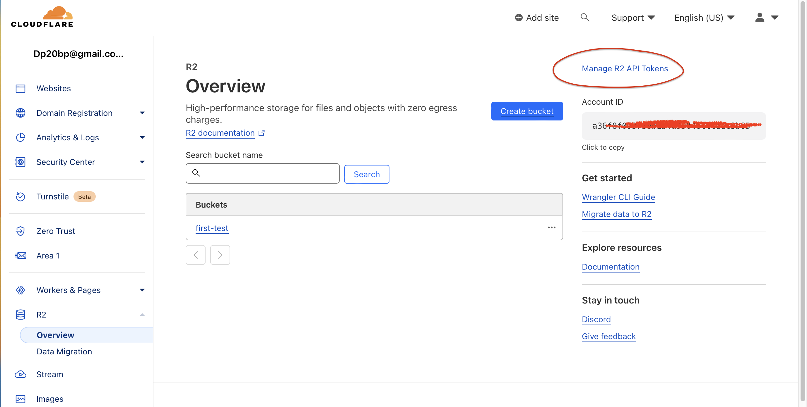
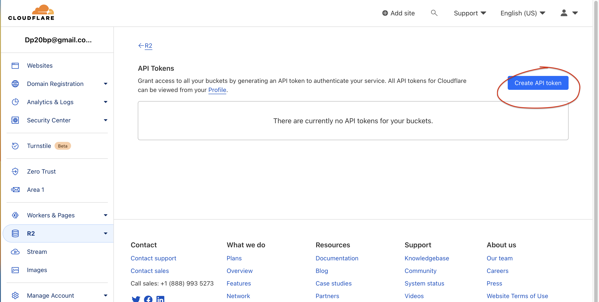
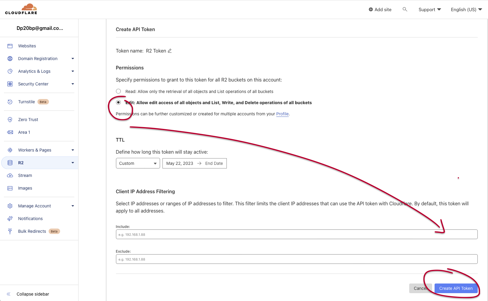
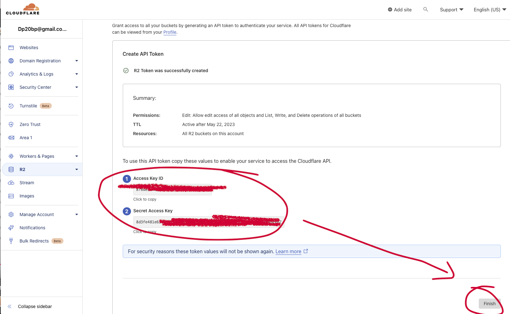

# nodejs sederhana dengan framework expressjs #

---

## Create API Token Cloudflare.

    

    

    

    

---

instalasi expressjs:

    ❯ npm install express

pastikan sebelumnya telah menginstall paket diperlukan yaitu :

- aws-sdk client

    - cara install

        ❯ npm install @aws-sdk/client-s3

    - tampilkan list paket
    
        ❯ npm list
            ├── dotenv@16.0.3

            ├── express@4.18.0
        
            └── @aws-sdk/client-s3@3.335.0

periksa file json dan buat file js secara manual serta isinya.

- package.json

- app.js

- .env

---

### PERHATIAN ! :

Dalam hal ini file .env saya enkripsi untuk tetap menjaga keamanan akses. Jika ingin melakukan deskripsi file tersebut, berikut adalah command terapannya :

    ❯  openssl aes-256-cbc -d -in ./.env.enc -out ./.env

---

jalankan (command) :

    ❯ node app.js
        op:
        Server running on port 3000

---

#### Test menggunakan command terminal
### Membuat bucket

    ❯ curl -X POST -H "Content-Type: application/json" -d '{"bucketName": "s3-demo-bucket-2"}' http://localhost:3000/buckets

    output:

        {"bucketName":"s3-demo-bucket","location":"/s3-demo-bucket"}

### Upload file terhadap bucket

    ❯ curl -X POST -H "Content-Type: application/json" -d '{"bucketName": "s3-demo-bucket", "fileName": "./sample-bucket-upload/test.txt", "fileContent": "test upload"}' http://localhost:3000/upload

    output:

        {"fileName":"demo.txt","ETag":"\"b10a8db164e0754105b7a99be72e3fe5\""}
        

---